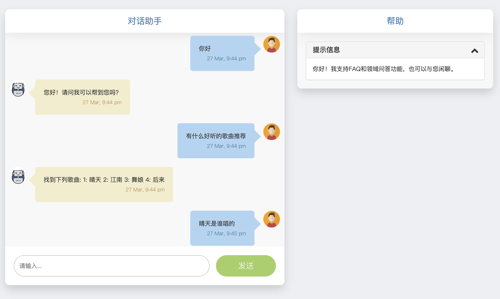

<h1 align="center"><a href="https://github.com/Hanscal/RasaChatBot" target="_blank">RasaChatBot</a></h1>


<p align="center">
  <a href="https://github.com/Hanscal/RasaChatBot/stargazers"></a>
  <a href="https://github.com/Hanscal/RasaChatBot/network/members"></a>
  <a href="https://github.com/Hanscal/RasaChatBot/watchers"></a>
  
</p>

# OverView
**一个基于Rasa3.0+的中文对话机器人, 一方面支持知识问答，另一方面支持智能闲聊**

# 创建项目一般步骤
1. 初始化项目(rasa init);  
2. 准备NLU数据(data/nlu.yml);  
3. 配置NLU模型(config.yml--pipline)。  
4. 准备故事数据(data/stories.yml);  
5. 定义领域(domain.yml);  
6. 配置rasa core模型(config.yml--policies)；  
7. 训练模型；  
8. 测试机器人； 

# 项目快速启动
1. rasa data validate [对标注数据进行检查]  
2. rasa train (train both nlu and core) [同时训练NLU模块和Core模块]  
3. rasa run actions (optional) if you redefined actions [如果没有定义actions，这个步骤可以跳过]  
4. rasa run --cors "*" --enable-api [使得可以通过web和api来访问服务] 
5. python start_service.py [启动服务]  

**下面两个步骤可能在debug或评估时会用到**
1. rasa shell (interactive with chat bot) [与训练的机器人交互，debug的时候使用]  
2. rasa evaluate markers all out.csv (evaluate chat bot) [评估部分，前期可略过]

## 学习资料
1. [官方文档](https://rasa.com/blog/what-s-ahead-in-rasa-open-source-3-0/)
2. [YouTube官方视频](https://www.youtube.com/channel/UCJ0V6493mLvqdiVwOKWBODQ)
3. [快速入门讲解英文](https://www.youtube.com/watch?v=PfYBXidENlg)
4. [快速入门项目中文](https://github.com/Chinese-NLP-book/rasa_chinese_book_code)


## 下一步工作 
### Entity
1. 对于明确的实体进行定义，并且作出有针对性的回答。
 
### Action
1. 进行数据校验, 和数据交互，采用MySQL存储FQA数据，通过接口实现功能分离；  
2. 与数据库(Neo4j)进行交互，更多的实体和关系属性定义. 

### Tokenizer
1. 自定义分词器，实现实体边界的覆盖；

### Interactive Learning
1. 交互式学习，提供反馈并修正错误；
2. RASA-X 1.1进行集成；

### Deploy
1. 模型部署与负载均衡；
2. 服务访问方式。


## api和web测试
**api请求**
```python
import json
import requests
url = "http://113.31.111.86:48088/live_assistant_api"
response = requests.post(url=url, data=json.dumps({"user_name":"hanscal","message":"你好"}))
print(response.json())
```

**web测试**  
* 在浏览器中输入网址`http://113.31.111.86:48088/live_assistant_ui`  
